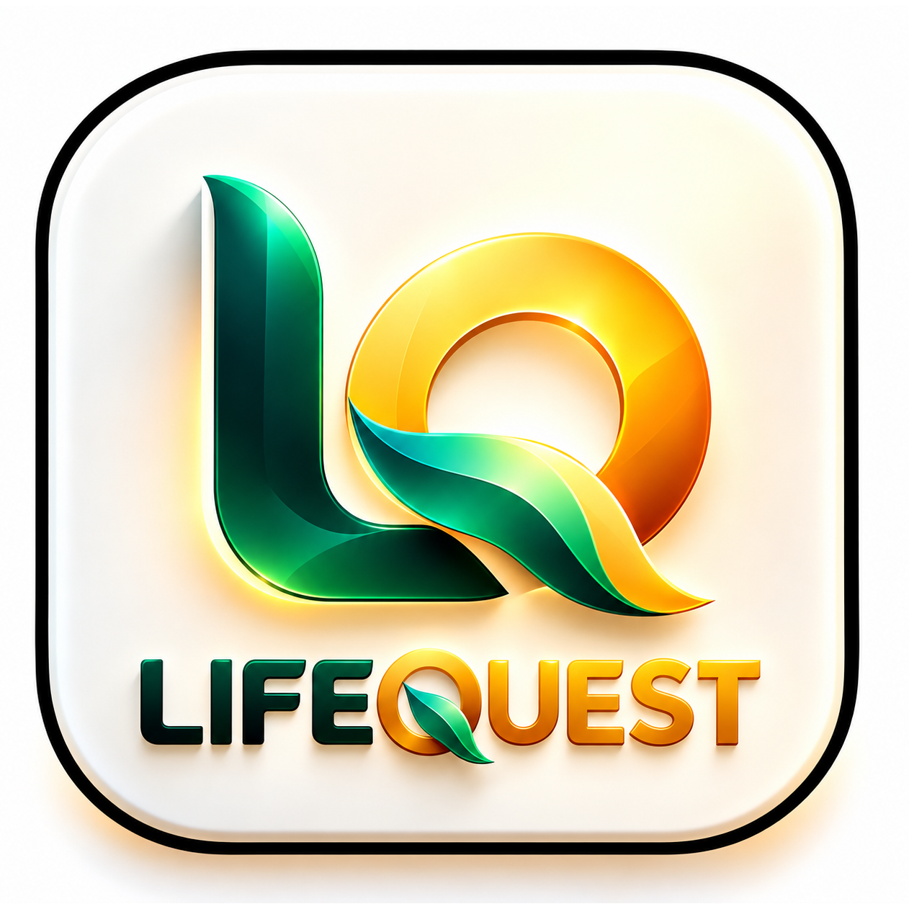
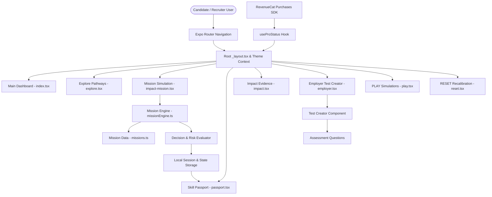

# LIFEQUEST

<p align="center">
  
</p>

<h3 align="center">Practice real life before life tests you.</h3>

<p align="center">
  <strong>Real Situations → Decisions → Consequences → Evidence → Skill Passport → Opportunities</strong>
</p>

<p align="center">
  
  
  
  
  
</p>

---

## 🚀 1. Hero & Product Summary

**LIFEQUEST** is a next-generation career readiness and capability evidence ecosystem. Built on React Native and Expo, LIFEQUEST bridges the gap between passive learning and real-world operational execution.

Traditional learning platforms focus on static video lectures and multiple-choice quizzes that test memorization rather than practical judgment. LIFEQUEST shifts the paradigm by introducing an interactive **Mission Engine** where candidates navigate realistic high-stakes scenarios, make critical decisions under constraints, face realistic consequences, and generate verifiable **Skill Evidence**.

```text
LEARN ──► PRACTICE ──► DECIDE ──► EXECUTE ──► MEASURE ──► BUILD EVIDENCE
```

Whether preparing for technical career tracks, situational leadership, quantitative aptitude, or employer assessments, LIFEQUEST turns candidate actions into observable proof of capability stored in an immutable **Skill Passport**.

---

## 🎯 2. Problem Statement

Modern career preparation and candidate hiring face structural inefficiencies:

1. **Passive Learning Fatigue**: Endless video streams and dry reading materials do not build decision-making confidence or operational agility.
2. **Resume Inflation & Lack of Evidence**: Resumes consist of self-reported claims rather than verifiable evidence of real-world decision quality.
3. **Fragmented Preparation**: Candidates must jump between disjointed quiz apps, flashcard tools, and interview guides with no unified tracking.
4. **Proxy-Based Employer Screening**: Employers rely on crude proxies (e.g., GPA, university brand, keyword matching) because observing authentic candidate judgment before hiring is difficult.
5. **Weak Connection to Real Decisions**: Standard standardized tests evaluate rote knowledge rather than how candidates prioritize, communicate, and manage risk under pressure.

---

## 💡 3. Target Solution Architecture

LIFEQUEST introduces an end-to-end framework connecting candidate readiness to employer evaluation:

```text
+-----------------------------------------------------------------------+
|                           LIFEQUEST ECOSYSTEM                         |
+-----------------------------------------------------------------------+
|                                                                       |
|   Candidate Journey                                                   |
|   1. Discover Career Pathways (18 Specialized Categories)             |
|   2. Launch Interactive Missions (Step-by-Step Decision Scenarios)    |
|   3. Receive Instant Risk & Tactical Performance Feedback             |
|   4. Accumulate Dynamic Proficiency in Skill Passport                 |
|   5. Log Verifiable Milestones in Impact Passport                     |
|                                                                       |
|   Employer Journey                                                    |
|   1. Create & Customize Multi-Category Assessment Tests               |
|   2. Select Core Competency Skills & Question Banks                   |
|   3. Live Preview & Publish Candidate Assessments                     |
|   4. Evaluate Real Candidate Decision Quality & Readiness Scores      |
|                                                                       |
+-----------------------------------------------------------------------+
```

---

## ✨ 4. Key Features

- 🎮 **Interactive Mission Engine**: Immersive scenarios with branching decision paths, risk scores, time constraints, and immediate tactical feedback.
- 🎯 **18 Career Readiness Pathways**: Comprehensive modules spanning Aptitude, Logical Reasoning, Puzzle Lab, Situational Judgment, Workplace Scenarios, Communication, and Interview Prep.
- 📊 **Skill Passport**: Real-time radar and domain bar tracking candidate capabilities across 6 core domains: Logical Thinking, Tactical Execution, Risk Management, Leadership, Communication, and Technical Aptitude.
- 📜 **Impact Passport**: Verifiable milestone record logging completed decision missions, decision efficiency, and performance evidence.
- 💼 **Employer Assessment Creator**: Full-featured portal for recruiters to draft, structure, preview, and deploy custom readiness assessments.
- ⚡ **SOLVE Mode**: Rapid-fire problem-solving drills designed for daily skill maintenance and quick scenario practice.
- 🏆 **PLAY Mode**: Gamified interactive simulations with streak tracking, dynamic difficulty, and performance rewards.
- 🧘 **RESET Mode**: Cognitive recalibration and focus micro-modules designed to relieve stress and reset mental acuity before high-stakes evaluations.
- 💎 **Monetization & Pro Tier**: Integrated RevenueCat SDK handling premium pathway unlocks, unlimited mission replays, and advanced analytics.
- ⚡ **Demo & Judge Presets**: Built-in fast-action pathways optimized for quick evaluator review.

---

## 📚 5. Career Readiness Modules

LIFEQUEST features 18 distinct readiness pathways organized into 7 primary domains:

| Domain | Pathway | Content Scope & Focus | Implementation Status |
| :--- | :--- | :--- | :--- |
| **Aptitude & Math** | Percentage & Ratios | Profit/Loss, Data Interpretation, Percentage change | Implemented (Interactive) |
| **Aptitude & Math** | Ratio & Proportion | Mixture problems, Scaling, Business proportions | Implemented (Interactive) |
| **Aptitude & Math** | Profit & Loss | Margin calculation, Discount structures, ROI | Implemented (Interactive) |
| **Aptitude & Math** | Number Series | Pattern recognition, Quadratic sequences, Missing terms | Implemented (Interactive) |
| **Logical Reasoning** | Coding & Decoding | Cipher algorithms, Pattern substitution, Logic rules | Implemented (Interactive) |
| **Logical Reasoning** | Analogy & Classification | Abstract relationship matching, Spatial logic | Implemented (Interactive) |
| **Logical Reasoning** | Sequence Analysis | Syllogisms, Deduction chains, Conditional logic | Implemented (Interactive) |
| **Puzzle Lab** | Matrix Puzzles | 3x3 grids, Spatial transformations, Numerical matrices | Implemented (Interactive) |
| **Puzzle Lab** | Pattern Recognition | Visual sequence completion, Shape logic | Implemented (Interactive) |
| **Puzzle Lab** | Logic Puzzles | Multi-variable constraints, Deductive grid solving | Implemented (Interactive) |
| **Situational Judgment** | Workplace Scenarios | Crisis management, Priority trade-offs | Implemented (Interactive) |
| **Situational Judgment** | Conflict Resolution | Team mediation, Stakeholder alignment | Implemented (Interactive) |
| **Workplace Readiness** | Project Prioritization | Time management under tight deadlines | Implemented (Interactive) |
| **Workplace Readiness** | Resource Allocation | Budgeting, Team capacity balancing | Implemented (Interactive) |
| **Communication** | Executive Writing | Professional email drafting, Status reporting | Implemented (Interactive) |
| **Communication** | Technical Explanation | Translating complex concepts for non-tech audiences | Implemented (Interactive) |
| **Interview Prep** | Technical & STAR Method | Behavioral STAR scenarios, System design basics | Implemented (Interactive) |
| **Interview Prep** | HR Fundamentals | Salary negotiation, Career narrative framing | Implemented (Interactive) |

> **Note on Content Architecture**: All 18 pathways feature live interactive UI routing, state management, scoring algorithms, and question banks. The content architecture is designed to support seamless continuous expansion of additional question sets.

---

## ⚙️ 6. Mission Engine Deep Dive

The Mission Engine (`src/engine/missionEngine.ts`) is the heartbeat of LIFEQUEST. It processes user choices against realistic decision trees.

### Core Data & Execution Model

```typescript
// Core Mission Interface Structure
export interface MissionStep {
  id: string;
  title: string;
  situation: string;
  choices: Choice[];
}

export interface Choice {
  id: string;
  text: string;
  consequence: string;
  riskScore: number;
  skillRewards: { domain: string; points: number }[];
  nextStepId?: string;
}
```

### Mission Execution Flow

1. **Briefing Phase**: The user is presented with a context-rich operational scenario (e.g., handling a production outage, resolving a client bottleneck).
2. **Decision Phase**: Multiple strategic options are presented, each associated with hidden risk multipliers and skill rewards.
3. **Evaluation Phase**: The engine calculates the decision's impact on project stability, team alignment, and time consumption.
4. **Feedback Phase**: The user receives immediate tactical feedback detailing why their choice was optimal or sub-optimal.
5. **Skill Accumulation**: Earned points are pushed directly to the user's local session state and merged into their **Skill Passport**.

---

## 🪪 7. Skill Passport & Capability Tracking

The **Skill Passport** (`src/app/passport.tsx`, `src/components/passport/`) translates raw mission data into standardized capability indices.

- **Logical Thinking**: Deductive reasoning, coding/decoding accuracy, puzzle mastery.
- **Tactical Execution**: Speed and precision in crisis scenarios and project prioritization.
- **Risk Management**: Ability to evaluate consequences and minimize operational fallout.
- **Leadership & Strategy**: Stakeholder alignment and decision accountability.
- **Communication**: Clarity, executive presentation, and conflict resolution score.
- **Technical Aptitude**: Mastery of quantitative and technical reasoning modules.

Visualized through sleek radar charts and progress bars, the Skill Passport serves as a portable proof-of-capability for job seekers.

---

## 🎖️ 8. Impact Passport & Evidence Log

The **Impact Passport** (`src/app/impact.tsx`, `src/components/impact/`) aggregates concrete evidence of achievement:

- **Verified Milestones**: Badges awarded for completing complex mission chains (e.g., "Crisis Master", "Quantitative Expert").
- **Decision Log**: Detailed history of past missions, decision paths taken, and performance accuracy over time.
- **Sharable Evidence Summary**: Structured record that can be exported or reviewed by potential employers.

---

## 👥 9. Employee & Employer Experiences

### Candidate / Employee Experience
Candidates use LIFEQUEST to self-assess, upskill, and prepare for high-stakes interviews:
- **Personal Dashboard**: Displays current readiness index, recommended missions, and daily streaks.
- **Skill Gap Discovery**: Identifies specific weak spots (e.g., low score in Risk Management) and suggests targeted pathways.
- **Practice History**: Complete breakdown of past performance with replay options.

### Employer Experience
Employers access a specialized assessment portal (`src/app/employer.tsx`):
- **Test Creation Suite**: Build custom assessment packages tailored to open job roles.
- **Skill Target Selection**: Select target domains (e.g., Quantitative + Situational Judgment).
- **Question Bank & Custom Questions**: Add, reorder, and edit assessment items.
- **Live Assessment Preview**: Test the candidate experience before publishing.
- **Candidate Evaluation**: Review candidate Skill Passports to make evidence-based hiring decisions.

---

## 🕹️ 10. SOLVE, PLAY, & RESET Modes

- **SOLVE** (`src/app/index.tsx`): Dedicated tab for rapid problem solving. Focuses on quick situational cases requiring fast decision choices.
- **PLAY** (`src/app/play.tsx`): Gamified interactive simulations (`src/data/playSimulations.ts`) featuring time pressure, streak combos, and interactive challenges.
- **RESET** (`src/app/reset.tsx`): Mindfulness and focus recalibration micro-modules. Helps candidates reduce anxiety and regain clarity before taking critical assessments.

---

## 🏗️ 11. Application Architecture



---

## 💻 12. Tech Stack

| Layer | Technology | Version | Purpose |
| :--- | :--- | :--- | :--- |
| **Framework** | React Native | `0.79.6` | Cross-platform mobile runtime |
| **Platform** | Expo | `^53.0.0` | Native toolchain & build environment |
| **Routing** | Expo Router | `~4.0.21` | File-based navigation & deep linking |
| **Language** | TypeScript | `~5.8.2` | Type-safe application development |
| **UI Components** | React Native Core | `0.79.6` | Native views, pressables, modals |
| **Icons & Visuals** | Lucide React Native | `^0.475.0` | Modern vector iconography |
| **Effects** | Expo Blur & LinearGradient | Latest | Glassmorphism & sleek dark UI effects |
| **Animations** | React Native Reanimated | `~3.16.7` | Smooth 60fps micro-interactions |
| **Monetization** | React Native Purchases | `^9.0.0` | RevenueCat in-app subscription SDK |
| **Build System** | EAS (Expo Application Services) | Latest | Cloud build & native APK/AAB generation |

---

## 📁 13. Project Structure

```text
D:\lifequest
├── assets/                       # Visual brand assets, icons, badges
│   └── images/
│       ├── icon.png              # Main LIFEQUEST app icon & brand mark
│       └── logo-glow.png         # Brand header graphic
├── src/
│   ├── app/                      # Expo Router screen routes
│   │   ├── _layout.tsx           # Global root layout & navigation container
│   │   ├── index.tsx             # Home dashboard & quick launcher
│   │   ├── explore.tsx           # 18 Career Readiness pathways catalog
│   │   ├── career.tsx            # Career pathway assessment interface
│   │   ├── passport.tsx          # Skill Passport visualization
│   │   ├── impact.tsx            # Impact Passport & evidence history
│   │   ├── impact-mission.tsx    # Live branching mission scenario player
│   │   ├── employer.tsx          # Employer test creation portal
│   │   ├── play.tsx              # Gamified simulation challenges
│   │   ├── reset.tsx             # Cognitive recalibration & focus drills
│   │   ├── privacy.tsx           # Privacy policy view
│   │   └── terms.tsx             # Terms of service view
│   ├── components/               # Modular UI components
│   │   ├── employer/             # Assessment builder & test previewers
│   │   ├── impact/               # Milestone badges & evidence cards
│   │   ├── monetization/         # Pro subscription modal & paywall
│   │   ├── passport/             # Skill radar charts & capability bars
│   │   ├── play/                 # Simulation cards & game timer HUD
│   │   └── reset/                # Focus timers & mindfulness controls
│   ├── constants/                # Global theme, typography, color palette
│   │   ├── colors.ts             # Dark mode palette definitions
│   │   └── theme.ts              # Spacing, radius & typography system
│   ├── data/                     # Content repositories
│   │   ├── missions.ts           # Branching mission decision trees
│   │   └── playSimulations.ts    # Gamified simulation challenge data
│   ├── engine/                   # Core business logic
│   │   └── missionEngine.ts      # Mission evaluation & scoring engine
│   ├── hooks/                    # Custom React hooks
│   │   └── useProStatus.ts       # RevenueCat entitlements & Pro state
│   ├── services/                 # External service abstractions
│   └── types/                    # TypeScript interfaces & domain types
│       └── mission.ts            # Mission, Step, Choice & Skill types
├── .gitignore                    # Exclusion rules for secrets, builds & caches
├── app.json                      # Expo app config & plugin settings
├── eas.json                      # EAS build profiles (development, preview, production)
├── package.json                  # Dependencies, scripts & metadata
├── package-lock.json             # Locked dependency tree
├── tsconfig.json                 # TypeScript compiler configuration
└── README.md                     # Comprehensive project documentation
```

---

## 🛠️ 14. Beginner Installation Guide

### Prerequisites
Before running LIFEQUEST, ensure you have the following installed:
- **Node.js**: `v18.0.0` or higher
- **npm** (included with Node) or **bun**
- **Git**: For version control
- **Expo Go App** (on mobile device) or **Android Studio** (for Android Emulator)

### 1. Clone the Repository
```bash
git clone https://github.com/Ajayrathod04/LIFEQUEST.git
cd LIFEQUEST
```

### 2. Install Dependencies
```bash
npm install
```

---

## 🏃 15. Running the Project

### Start the Expo Development Server
```bash
npx expo start
```

### Options for Viewing the Application:
- **Physical Android Device**: Install **Expo Go** from Google Play Store. Scan the QR code printed in the terminal.
- **Android Emulator**: Ensure Android Studio emulator is running, then press `a` in the terminal.
- **Clear Cache** (if experiencing Metro bundler issues):
  ```bash
  npx expo start -c
  ```

---

## 🧪 16. Typecheck & Validation

Run strict TypeScript typechecking to ensure 100% type safety and zero structural errors:

```bash
npx tsc --noEmit
```

Run Expo configuration health diagnostics:

```bash
npx expo-doctor
```

---

## 📱 17. Android Development & Build Notes

LIFEQUEST utilizes Expo Continuous Native Generation (CNG). 

- **JavaScript / React Native UI Changes**: Edit source code in `src/`. Metro reloads instantly without needing a native rebuild.
- **Native Configuration Changes**: Native plugin adjustments in `app.json` or native dependencies are handled via EAS Build.
- **Local Development Build Command** (Optional):
  ```bash
  npx expo run:android
  ```

> ⚠️ **Important**: Do not commit local generated `android/` build artifacts or debug keystores to repository control.

---

## 🔒 18. Environment Variables & Security

LIFEQUEST relies on environment variables for external integrations such as RevenueCat.

### Local `.env` Configuration
Create a `.env` file in the root directory (this file is excluded via `.gitignore`):

```env
EXPO_PUBLIC_REVENUECAT_ANDROID_KEY=your_revenuecat_android_public_api_key
```

### Security Directives
- **Never Commit Secrets**: Secrets, `.env` files, `.jks` Android keystores, and private credentials are excluded via `.gitignore`.
- **Public Keys**: Only keys prefixed with `EXPO_PUBLIC_` are safely bundled into the client build.

---

## 🧪 19. Quality Assurance & Validation Matrix

LIFEQUEST undergoes rigorous multi-layer validation before any release:

1. **TypeScript Type Safety**: `npx tsc --noEmit` returns zero compilation errors.
2. **Dependency Health**: `npx expo-doctor` confirms 21/21 configuration checks pass.
3. **Format & Syntax Consistency**: Verified clean file endings and strict lint adherence.
4. **Physical Device QA**: Verified on physical Android hardware across touch targets, navigation flow, and state persistence.

---

## 🗺️ 20. Candidate User Journey

```text
1. ONBOARDING
   Candidate opens LIFEQUEST ──► Views overall Readiness Index on Main Dashboard

2. PATHWAY EXPLORATION
   Navigates to Explore ──► Selects Aptitude, Logical Reasoning, or Workplace Scenario

3. MISSION EXECUTION
   Launches Impact Mission ──► Reads situational briefing ──► Makes strategic choice

4. FEEDBACK & CONVICTION
   Engine computes risk score ──► Explains tactical consequence ──► Awards Skill XP

5. PASSPORT GROWTH
   Skill Passport updates domain radar chart ──► Impact Passport logs milestone evidence

6. EMPLOYER READY
   Candidate shares verified Skill Passport with recruiters for evidence-based hiring
```

---

## 🏢 21. Employer Assessment Journey

```text
1. PORTAL ACCESS
   Recruiter opens Employer tab ──► Selects "Create New Assessment"

2. TARGETING SKILLS
   Selects domain competencies (e.g., Logical Reasoning + Conflict Resolution)

3. QUESTION ASSEMBLY
   Selects items from Question Bank or inputs custom situational scenarios

4. PREVIEW & PUBLISH
   Launches live assessment preview ──► Finalizes test structure for applicants

5. EVALUATION
   Recruiter views candidate decision quality and evidence metrics directly
```

---

## 🎬 22. 3-Minute Hackathon Demo Flow

For judges and evaluators reviewing LIFEQUEST in a limited timeframe:

1. **0:00 - 0:30 (Home Dashboard)**: Show the primary readiness index, active streak, and quick launch mission cards.
2. **0:30 - 1:15 (Mission Engine in Action)**: Navigate to `Explore` -> Launch `Impact Mission`. Make a decision, highlight the instant risk evaluation and tactical feedback loop.
3. **1:15 - 1:45 (Skill & Impact Passports)**: Navigate to `Passport`. Show how decision choices dynamically alter the capability radar chart and log evidence.
4. **1:45 - 2:15 (Employer Portal)**: Open `Employer`. Demonstrate creating a test, selecting skills, and launching live test preview.
5. **2:15 - 3:00 (PLAY & RESET Modes)**: Briefly show the gamified simulation challenges (`PLAY`) and cognitive recalibration micro-drills (`RESET`).

---

## ⚡ 23. Key Differentiation

| Feature | Generic Quiz Apps | Video Course Platforms | Standard HR Tools | LIFEQUEST Ecosystem |
| :--- | :---: | :---: | :---: | :---: |
| **Primary Focus** | Rote Memorization | Passive Watching | Resume Parsing | Operational Decision Quality |
| **Feedback Loop** | Correct / Incorrect | None (Static) | None | Risk Score & Tactical Consequence |
| **Evidence Model** | Quiz Score | Completion Badge | Self-reported Text | Verifiable Skill & Impact Passport |
| **Employer Integration**| None | None | Keyword Filtering | Live Test Creator & Decision Analytics |
| **User Experience** | Dry Text Items | Long Videos | Complex Forms | Gamified Missions + PLAY & RESET |

---

## 🎨 24. Design System & UI Aesthetics

LIFEQUEST features a modern, premium dark-mode visual design language:

- **Color Palette**:
  - **Deep Obsidian (`#090D16`)**: Rich background foundation for contrast.
  - **Indigo Accent (`#6366F1`)**: Primary action buttons and navigation highlights.
  - **Emerald Success (`#10B981`)**: Positive skill rewards and high-accuracy indicators.
  - **Amber Risk (`#F59E0B`)**: Moderate risk warnings and situational alerts.
  - **Cyber Pink (`#EC4899`)**: High-priority callouts and active streak badges.
- **Typography**: Clean system font stacks scaled for mobile legibility.
- **Glassmorphism**: Translucent card backgrounds using `Expo Blur` for depth and modern feel.

---

## 🔄 25. Data & State Management

- **Local Session Engine**: Mission progress, step states, and interim choices are held securely in react state and local storage.
- **Reactive Hooks**: Custom hooks (e.g., `useProStatus`) encapsulate side effects and keep UI components clean and presentational.
- **Zero Heavy Global Overheads**: Fast execution optimized for high-frame-rate mobile performance.

---

## 🤝 26. Contributing

We welcome contributions to LIFEQUEST!

1. Fork the repository.
2. Create a feature branch: `git checkout -b feature/amazing-new-pathway`
3. Commit your changes: `git commit -m "Add new Situational Leadership pathway"`
4. Verify TypeScript: `npx tsc --noEmit`
5. Push to the branch: `git push origin feature/amazing-new-pathway`
6. Open a Pull Request.

---

## ❓ 27. Troubleshooting

### 1. Metro Bundler Cache Issues
If screens do not refresh or dependency resolution errors occur:
```bash
npx expo start -c
```

### 2. Port 8081 Already in Use
Kill existing Node processes or specify a different port:
```bash
npx expo start --port 8082
```

### 3. TypeScript Compilation Errors
If type mismatches appear after pulling new updates:
```bash
npx tsc --noEmit
```

### 4. Expo Go Version Mismatch
Ensure your Expo Go app on Android is updated to match Expo SDK 53.

---

## 🔄 28. Standard Development Workflow

```bash
# Check repository status
git status

# Pull latest remote changes
git pull origin main

# Install any newly added dependencies
npm install

# Run TypeScript validation
npx tsc --noEmit

# Start development server
npx expo start
```

---

## 🗺️ 29. Future Roadmap

- 🤖 **AI Scenario Generator**: Dynamically generate branching mission trees tailored to specific job descriptions.
- 🔗 **Blockchain / Verifiable Credentials**: Issue cryptographic credentials for top-tier Skill Passport achievements.
- 📊 **Enterprise Employer Analytics**: Rich applicant cohort analytics and heatmaps for corporate talent acquisition teams.
- 🌐 **Web Extension Portal**: Desktop-optimized web viewer for recruiters to evaluate candidate passports.

---

## 🏆 30. Hackathon & Submission Abstract

> **LIFEQUEST** transforms career preparation from passive content consumption into an interactive, decision-driven mission platform. By evaluating how candidates navigate real-world workplace scenarios, risk trade-offs, and quantitative puzzles, LIFEQUEST produces an immutable, observable **Skill Passport**. Simultaneously, it empowers recruiters with a custom assessment creator portal to make evidence-based hiring decisions. Built with React Native, Expo Router, and TypeScript, LIFEQUEST sets a new benchmark for modern capability platforms.

---

## 📄 31. License

This project is licensed under the MIT License - see the `LICENSE` file for details.

---

## 🙏 32. Acknowledgements

- **Expo Team**: For building the premier React Native development framework.
- **Lucide Icons**: For clean visual iconography.
- **RevenueCat**: For seamless in-app purchase infrastructure.
- **React Native Community**: For cross-platform tools and libraries.

---

## ⚡ 33. Final Quick Start Summary

```bash
# 1. Clone
git clone https://github.com/Ajayrathod04/LIFEQUEST.git
cd LIFEQUEST

# 2. Install
npm install

# 3. Typecheck
npx tsc --noEmit

# 4. Launch
npx expo start
```